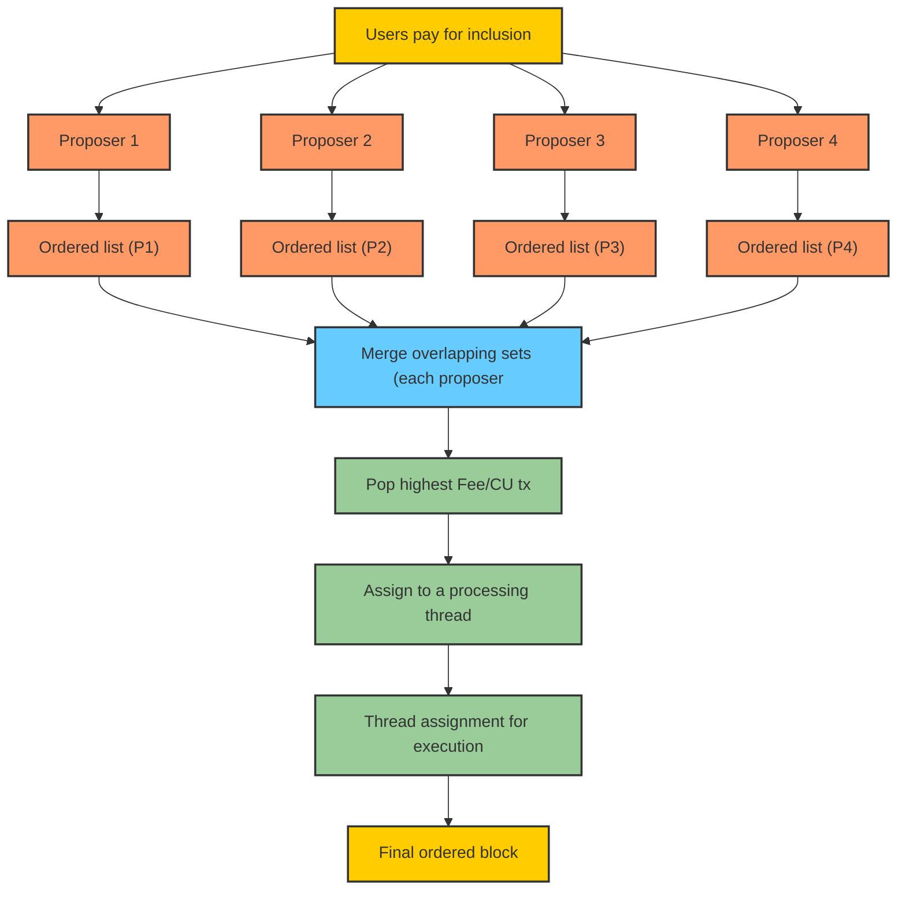

This is the start of an algorithm to zipper multiple proposer's txs.

Users pay for inclusion to any/all validators. The validator includes then orders based on Fee/CU. That's it, they don't pack into threads or execute because the final block will be zippered.

Each proposer sends their ordered list of txs **and** an array of accounts that overlap.

Each proposer takes the other proposers' array of overlapping sets, and merges the sets to have a complete view of the overlapping sets.

They then take the ordered lists of txs from each proposer. They pop off the highest Fee/CU tx, map it to the overlapping set.

There are many easy way to take this overlapping set and deterministically make a mapping to a thread for processing.

TODO:
- What is the deterministic mapping from proposers to threads?
- - Ordering the sets and snaking them across threads should be ok, but not optimal.
- can you use the total CU of the overlapping set?

 